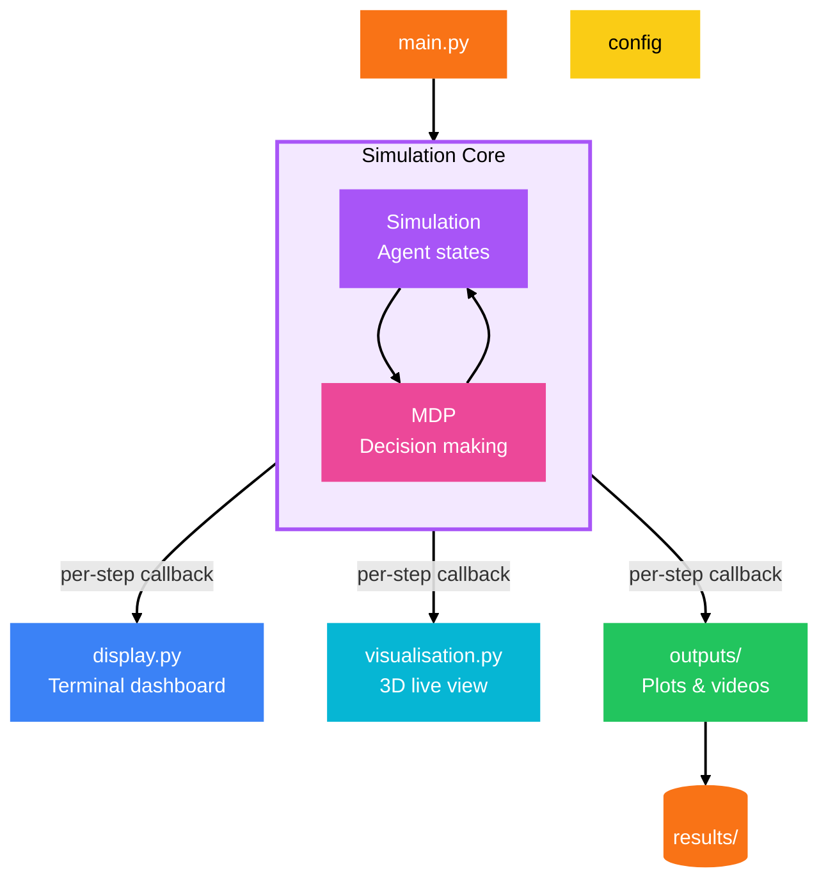

# System Diagram — Pursuit-Evasion Simulation

```mermaid
flowchart TB
    main["main.py"]

    subgraph CORE["Simulation Core"]
        direction TB
        sim["Simulation\nAgent states"]
        mdp["MDP\nDecision making"]
        sim --> mdp --> sim
    end

    display["display.py\nTerminal dashboard"]
    vis["visualisation.py\n3D live view"]
    outputs["outputs/\nPlots & videos"]
    results[("results/")]

    main --> CORE

    CORE -->|"per-step callback"| display
    CORE -->|"per-step callback"| vis
    CORE -->|"per-step callback"| outputs
    outputs --> results

    linkStyle default stroke:#000,stroke-width:2px

    style main    fill:#f97316,color:#fff,stroke:none
    style CORE    fill:#f3e8ff,stroke:#a855f7,stroke-width:3px,color:#000
    style sim     fill:#a855f7,color:#fff,stroke:none
    style mdp     fill:#ec4899,color:#fff,stroke:none
    style config  fill:#facc15,color:#000,stroke:none
    style display fill:#3b82f6,color:#fff,stroke:none
    style vis     fill:#06b6d4,color:#fff,stroke:none
    style outputs fill:#22c55e,color:#fff,stroke:none
    style results fill:#f97316,color:#fff,stroke:none
```
